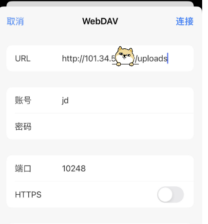

# httpd_conf
my httpd_conf on docker , include cgi, webdav

# deps
```
docker pull httpd
```

# usage

to run a httpd + cgi + webdav server, use 
```
sh setup_httpd.sh

```


this will start a docker server on :10248-->:80

the cgi will run like:

```
curl localhost:10248/cgi-bin/printenv
```

the webdav url will be:
```
http://localhost:10248/uploads
```

you can use curl to do some simple test on webdav's connections.

```
# uploads a file
curl --digest  -u  'jd:pw' "http://localhost:10248/uploads/"  -T 1.txt

# downloads a file
curl --digest  -u  'jd:pw' "http://localhost:10248/uploads/1.txt"  -o 1_new.txt

# list all files
curl -X PROPFIND --digest -u 'jd:pw' http://localhost:10248/uploads/   -H "Depth: 1" |grep uploads
```

or , one can use any webdav client,like ios app: ES file explorer to open and uploads files.



happy , enjoy, gogogo :)


author: jd

email: tlqtangok@126.com

